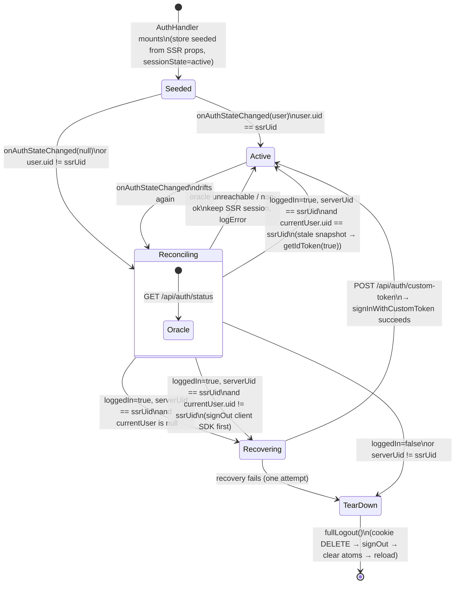

# Feature: Session state machine

## Blueprint

### Context

Defines the client×server session states and the reconcile behavior `AuthHandler` must implement for each. A valid server cookie with an absent or mismatched client SDK user is a **recoverable** state — the client re-signs itself in via a server-minted custom token. Session teardown (`fullLogout`) happens only when the server authoritatively rejects the session or recovery fails.

### Architecture

- **Components:**
  - `packages/auth/src/components/AuthHandler.svelte` — owns the machine. Mounted only when SSR verified the cookie (`Astro.locals.uid` non-null), so every run starts from a server-valid session.
  - `app/pelilauta/src/pages/api/auth/custom-token.ts` — recovery endpoint (new). `POST`: resolves the session cookie via `app/pelilauta/src/utils/resolveSession.ts`, mints a Firebase custom token for the cookie's uid via firebase-admin `createCustomToken`, returns `{ token }`. Available in dev and production — it is the recovery path for real users, not a test fixture.
- **API Contracts:**
  - `POST /api/auth/custom-token` → `200 { token }` with `Cache-Control: no-store` when the session cookie is valid; `401` when the cookie is missing or fails verification. No request body. The token is minted for the cookie's uid only — the caller cannot choose an identity.
  - Client recovery: `signInWithCustomToken(auth, token)` from `@pelilauta/firebase/client`.
- **Dependencies:** [`./spec.md`](./spec.md) (cookie contract, status oracle, `fullLogout` semantics), [`../firebase/spec.md`](../firebase/spec.md) (`createCustomToken`, client `signInWithCustomToken`).
- **Constraints:**
  - Recovery is attempted **exactly once** per reconcile run. A failed recovery falls through to `fullLogout()` — no retry loops (same posture as token repair in `./spec.md`).
  - A status-oracle transport failure (network error, non-ok response) keeps the SSR-seeded session and logs via `@pelilauta/utils/log`. The cookie was verified server-side on the paint that mounted `AuthHandler`; an unreachable oracle is not evidence the session is invalid.
  - On uid mismatch (client SDK signed in as a different user than the cookie), the server identity wins: the client SDK is signed out, then recovered as the cookie's uid.

### States and transitions

Client SDK state is reported by `onAuthStateChanged`; server state by `GET /api/auth/status`. `ssrUid` is the cookie identity SSR verified at paint.



In `Active` the client SDK carries the cookie's identity: Bearer writes (`authedFetch`) and real-time subscriptions are fully functional. `TearDown` is reached only from the two authoritative-rejection edges and failed recovery — never directly from a missing client user.

## Contract

### Definition of Done

- [ ] `POST /api/auth/custom-token` returns `200 { token }` (`Cache-Control: no-store`) for a valid session cookie and `401` otherwise.
- [ ] `reconcile()` recovers a null-client-user session via the custom-token endpoint instead of calling `fullLogout()`.
- [ ] `reconcile()` resolves a client/server uid mismatch by signing the client SDK out and recovering as the cookie's uid.
- [ ] A status-oracle transport failure leaves the SSR-seeded session intact (no logout, no reload) and emits a structured log.
- [ ] After successful recovery, `authedFetch` writes carry a Bearer token for the cookie's uid.

### Regression Guardrails

- **A valid server session is never torn down because the client SDK lacks a user.** `fullLogout()` from reconcile requires server rejection (`loggedIn=false` or `serverUid != ssrUid`) or a failed recovery attempt.
- **The custom-token endpoint mints only the cookie's identity.** No request parameter may influence the minted uid.
- **Recovery is single-shot.** One custom-token attempt per reconcile run; failure exits via `fullLogout()`.

### Testing Scenarios

Specs describe intent. Verification artifacts declare coverage upward via `Verifies:` tags (see `specs/VERIFICATION.md`).

#### Scenario: Custom-token endpoint mints for a valid cookie

```gherkin
Given a POST to "/api/auth/custom-token" with a valid "session" cookie for uid "u1"
When the route handler runs
Then createCustomToken is called with "u1"
And the response is 200 with body { token }
And the response sets Cache-Control: no-store
```

#### Scenario: Custom-token endpoint rejects a missing or invalid cookie

```gherkin
Given a POST to "/api/auth/custom-token" with no "session" cookie, or one that fails verification
When the route handler runs
Then the response is 401
And createCustomToken is NOT called
```

#### Scenario: Reconcile recovers a missing client user

```gherkin
Given AuthHandler is mounted with ssrUid "u1"
And onAuthStateChanged fires with null
And GET /api/auth/status reports loggedIn=true with uid "u1"
When reconciliation runs
Then POST /api/auth/custom-token is called
And signInWithCustomToken is called with the returned token
And fullLogout is NOT called
And no reload occurs
```

#### Scenario: Reconcile resolves a uid mismatch in the server's favor

```gherkin
Given AuthHandler is mounted with ssrUid "u1"
And onAuthStateChanged fires with a user whose uid is "u2"
And GET /api/auth/status reports loggedIn=true with uid "u1"
When reconciliation runs
Then auth.signOut is called before recovery
And signInWithCustomToken signs the client in as "u1"
And fullLogout is NOT called
```

#### Scenario: Failed recovery exits via fullLogout

```gherkin
Given reconciliation has entered recovery
And POST /api/auth/custom-token fails OR signInWithCustomToken rejects
When the recovery attempt completes
Then exactly one recovery attempt was made
And fullLogout is called
```

#### Scenario: Oracle transport failure preserves the session

```gherkin
Given AuthHandler is mounted with ssrUid "u1"
And onAuthStateChanged fires with null
And GET /api/auth/status is unreachable or returns a non-ok status
When reconciliation runs
Then fullLogout is NOT called
And no reload occurs
And the session store keeps the SSR-seeded uid and sessionState "active"
And a structured error is logged
```

#### Scenario: Seeded e2e session is fully functional after hydration

```gherkin
Given a Playwright test that plants only the server session cookie (no client SDK sign-in)
When the page hydrates and reconciliation completes
Then the session survives (no logout, no reload)
And the client SDK reports the cookie's uid
```
